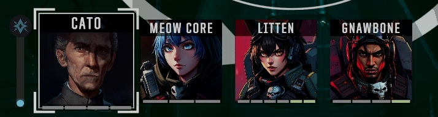

# Battletech-Pilot-Sprites-Repo

##### These sprites are AI generated using https://deepai.org/

To set custom Pilot Sprites, you will need:

[Commander Portrait Loader](https://github.com/BattletechModders/CommanderPortraitLoader) - 
put sprite PNG's in here

[Battletech Save Editor](https://discourse.modsinexile.com/t/battletech-save-editor/710) - use this to assign images to pilots

Do not use the Nexus version of those mods, they are out of date and not supported.

---

To set custom Company Emblems, you will need:

[Norse Symbols Emblem Pack](https://www.nexusmods.com/battletech/mods/479) - put emblem PNG's or DDS files in here

... or any other emblem dll mod which loads sprites.

